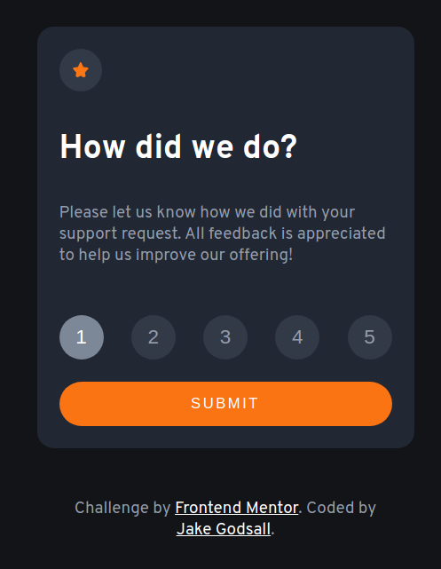
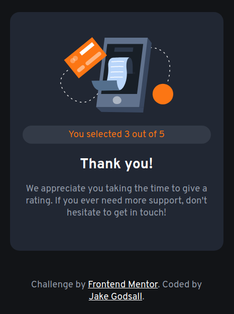

# Frontend Mentor - Interactive rating component solution

This is a solution to the [Interactive rating component challenge on Frontend Mentor](https://www.frontendmentor.io/challenges/interactive-rating-component-koxpeBUmI). Frontend Mentor challenges help you improve your coding skills by building realistic projects.

## Table of contents

- [Overview](#overview)
  - [The challenge](#the-challenge)
  - [Screenshot](#screenshot)
  - [Links](#links)
- [My process](#my-process)
  - [Built with](#built-with)
  - [What I learned](#what-i-learned)
  - [Continued development](#continued-development)
- [Author](#author)

## Overview

### The challenge

Users should be able to:

- View the optimal layout for the app depending on their device's screen size
- See hover states for all interactive elements on the page
- Select and submit a number rating
- See the "Thank you" card state after submitting a rating

### Screenshot

<table>
  <tr>
    <td>

    </td>
    <td>
    
    </td>
  </tr>
</table>

- Live Site URL: [Netlify](https://jakegodsall-interactive-rating.netlify.app/)

## My process

### Built with

- Semantic HTML5 markup
- CSS custom properties
- Flexbox
- SCSS
- Mobile-first workflow
- Vanilla JS

### What I learned

I have learned a ton from completing this project. 
This is the first Frontend Mentor project I have worked on where I have used JavaScript. The most notable points here are:

- How to use event listeners to select one from many elements via clicking (and remove previous selection)
- How to use `display:none` to hide and show different components using event listeners.

### Continued development

I shall continue to work on similar projects, until the intersection of HTML, CSS and JavaScript becomes more intuitive to me. Also, I will learn how to use `display:grid` for the next project I work on.

## Author

- Website - [Jake Godsall](https://www.jakegodsall.com)
- Frontend Mentor - [@jakegodsall](https://www.frontendmentor.io/profile/jakegodsall)
- LinkedIn - [@godsalljake](https://www.linkedin.com/in/godsalljake/)
